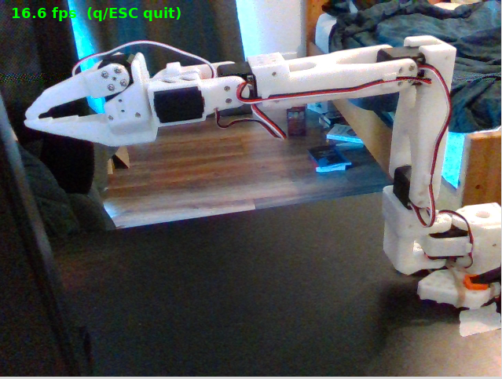
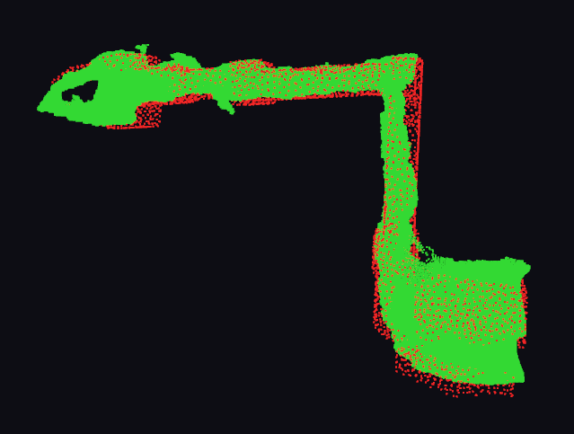
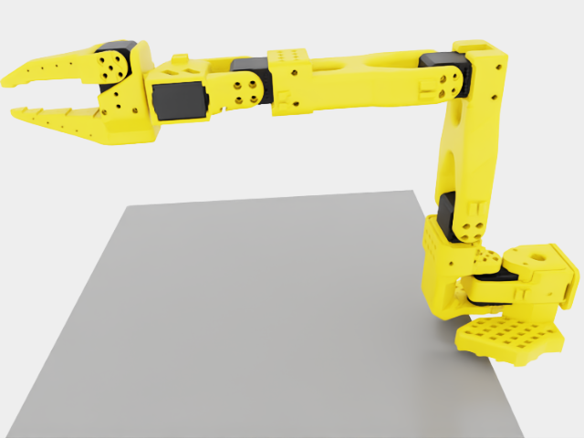

# isaac-auto-scene

Capture one RealSense D435 RGB-D frame from a fixed mount, segment the table
plane + arm cloud, register against the SO-101 CAD model (URDF FK), and emit
a calibrated Isaac Sim scene that mirrors the real setup — camera + SO-101
+ table at registered poses, with the captured joint configuration baked
into the rendered USD.

End-to-end workflow tested on real D435 + SO-101 follower; reaches mean
fitness 0.82 / RMSE 10 mm across a 5-pose multi-pose bundle on the test rig.

## Pipeline at a glance

Real RealSense D435 frame → manual CAD-over-cloud alignment → calibrated
Isaac Sim render of the mirrored scene:

| 1. Real camera (D435) | 2. Manual CAD alignment | 3. Isaac Sim render |
| :---: | :---: | :---: |
|  |  |  |

## Install

```bash
# Default env (geometry + dev, no Isaac Sim, no hardware deps).
pixi install

# Add the simulation feature (Isaac Sim 6.0 via the sibling
# lerobot-isaac-training env — see project CLAUDE.md for why we borrow
# rather than install).
pixi install -e sim

# Add hardware features (RealSense + lerobot SO-101 follower driver).
pixi install -e hardware

# LeRobot is not declared in the hardware feature because its rerun-sdk
# wheel doesn't match pixi's manylinux baseline on Python 3.11.  Install
# manually into the hardware env:
pixi run install-lerobot
```

## Quickstart

```bash
# 1. Calibrate the SO-101 servos once per robot.
pixi run -e hardware isaac-auto-scene calibrate-arm

# 2. Move the arm physically to the URDF home pose (all links straight,
#    extended forward) and capture the home-offset that maps LeRobot
#    servo zero -> URDF joint zero.
pixi run -e hardware isaac-auto-scene set-home --urdf path/to/so101_new_calib.urdf

# 3. Drive the arm through a safe 5-pose set with live D435 capture.
pixi run -e hardware isaac-auto-scene capture-poses \
  --urdf path/to/so101_new_calib.urdf \
  --poses assets/poses/so101_safe_5pose.yaml \
  --out /tmp/cap --check-floor

# 4. Manually align CAD-over-cloud for each pose in a viewer.  Y to save.
pixi run -e hardware isaac-auto-scene manual-align-all \
  --captures /tmp/cap \
  --urdf path/to/so101_new_calib.urdf \
  --no-icp-refine

# 5. Combine the per-pose calibs into one shared SE(3) via bundle
#    adjustment (single T_cam_arm jointly optimised over all 5 poses).
pixi run -e hardware isaac-auto-scene register-multi \
  --captures /tmp/cap \
  --urdf path/to/so101_new_calib.urdf \
  --backend bundle \
  --init-from-dir ~/.config/isaac-auto-scene/manual-calibs

# 6. Render the calibrated scene to a PNG.
pixi run -e hardware isaac-auto-scene render \
  --calib ~/.config/isaac-auto-scene/calib_bundle.json \
  --out /tmp/frame.png
```

Per-arm calibration state (home offset, sign-flip, last calib) persists in
`~/.config/isaac-auto-scene/` so it survives reboots.  See `docs/usage.md`
for the full reference and `docs/troubleshooting.md` for hardware pitfalls.

## CLI

```bash
isaac-auto-scene calibrate-arm       # interactive LeRobot calibration
isaac-auto-scene set-home            # capture URDF home-offset from current pose
isaac-auto-scene calibrate           # single-pose auto-register
isaac-auto-scene capture-poses       # drive arm through pose set, record RGB-D
isaac-auto-scene register-multi      # multi-pose ICP + bundle
isaac-auto-scene manual-align        # interactive single-pose viewer
isaac-auto-scene manual-align-all    # interactive loop over a capture set
isaac-auto-scene generate            # calib.json -> scene.usda stub
isaac-auto-scene render              # calib.json -> PNG via Isaac Sim
isaac-auto-scene validate            # forward-projection residual report
isaac-auto-scene smoke               # capture -> register -> render end-to-end
```

Registration backends on `register-multi`:

- `per_pose` (default) — independent per-pose ICP, weighted-average aggregation
- `bundle` — joint multi-pose se(3) Levenberg-Marquardt for one shared T
- `bundle_joints` — bundle + per-joint offset Δθ (URDF kinematic calibration)

## Development

```bash
pixi run test          # default-env unit tests
pixi run test-hw       # add --run-hardware (needs D435 + SO-101 plugged in)
pixi run lint          # ruff check
pixi run fmt           # ruff format
pixi run typecheck     # mypy
```

## Isaac Sim requirement

The `sim` feature and the `render` command need an **Isaac Sim 6.0 + Isaac Lab**
Python environment. This package does not install Isaac Sim itself — on the
development rig it borrows the interpreter from a sibling `lerobot-isaac-training`
pixi env (see [CLAUDE.md](CLAUDE.md) for the rationale).

To use your own Isaac Sim install, point the renderer at its interpreter:

```bash
export ISAAC_PYTHON=/path/to/your/isaac-sim/python
# or per-invocation:
isaac-auto-scene render --calib calib.json --out frame.png \
  --isaac-python /path/to/your/isaac-sim/python
```

The geometry/registration pipeline (capture, segment, register) runs in the
default env and needs no Isaac Sim.

## Reference

- Isaac Sim 6.0 + Isaac Lab 0.54.3 — see [Isaac Sim requirement](#isaac-sim-requirement)
- Python 3.11 + Open3D 0.18 (tensor-API ICP only — legacy pipeline segfaults
  on this build, see [CLAUDE.md](CLAUDE.md))
- Design notes & known pitfalls: [docs/usage.md](docs/usage.md),
  [docs/troubleshooting.md](docs/troubleshooting.md)

## License

MIT — see [LICENSE](LICENSE).
